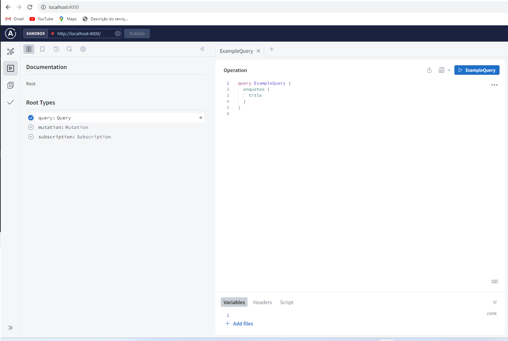

# Sistema de Votos e Enquetes

Esse projeto é uma api Graphql responsável por criar enquetes e computar votos em tempo real. As informações são armazenadas no Realtime database do firebase. Para publicar ele foi integrado ao framework serverless para ser publicado na AWS Lambda

### 🔧 Instalação

No terminal, clone o projeto:

```
git clone https://github.com/diego-silva1016/serverless_graphql.git
```

Entre na pasta do projeto e rode:

```
yarn install
```

Crie um arquivo .env e adicione a chave do banco firebase.

Para iniciar o servidor, rode o comando:

```
node src/index.js
```

Para acessar a documentação acesse: 

```
http://localhost:4000/
```



Para iniciar o front end da aplicação, entre na pasta voting-front e rode o comando:

```
yarn install
```

Para iniciar o front, rode o comando:

```
yarn start
```


## Arquitetura dos Componentes

Arquitetura de compoenetes segue o modelo de comunicação conforme demonstrado no diagrama abaixo:


## 🛠️ Construído com

* [Apollo Graphql](https://www.apollographql.com/docs/apollo-server/)
* [Serverless](https://www.serverless.com/)
* [Firebase](https://firebase.google.com/?hl=pt)
* [React](https://react.dev/)


## Boas Práticas de Desenvolvimento

Nesta seção, abordaremos boas práticas de desenvolvimento para a nossa aplicação Serverless GraphQL integrada ao Firebase. Estas diretrizes visam garantir a segurança, escalabilidade, monitoramento e qualidade do código.

### Segurança:

1. **Autenticação e Autorização:**
   - Utilize o Firebase Authentication para gerenciar a autenticação de usuários.
   - Configure as regras de segurança no Firebase Realtime Database para controlar o acesso aos dados. Evite permitir leitura/gravação irrestrita.

2. **Validação de Entradas:**
   - Valide todas as entradas de dados vindas dos clientes para evitar vulnerabilidades como SQL injection e Cross-Site Scripting (XSS).
   - Utilize bibliotecas e frameworks que escapem automaticamente os dados.

### Escalabilidade:

3. **Arquitetura Serverless:**
   - Aproveite a natureza serverless da AWS Lambda para escalabilidade automática.
   - Projete as funções Lambda para serem independentes e eficientes, facilitando o dimensionamento conforme a demanda aumenta.

4. **Cache e Armazenamento:**
   - Considere a implementação de cache para reduzir a carga do Firebase Realtime Database.
   - Utilize serviços como o Amazon ElastiCache para cache de dados quando apropriado.

### Monitoramento:

5. **Logs e Rastreamento:**
   - Implemente logs detalhados para rastrear eventos, erros e atividades suspeitas.
   - Utilize serviços como AWS CloudWatch para coletar e analisar logs.
   - Considere a integração com ferramentas de rastreamento como AWS X-Ray para identificar problemas de desempenho.

6. **Alertas e Notificações:**
   - Configure alertas para serem notificados sobre eventos críticos, como falhas no servidor ou picos de tráfego anormais.
   - Estabeleça políticas claras de resposta a incidentes para lidar com problemas rapidamente.

### Melhores Práticas de Codificação:

7. **Padrões de Codificação:**
   - Mantenha um conjunto consistente de padrões de codificação em toda a equipe.
   - Utilize ferramentas de análise estática de código, se disponíveis, para identificar problemas de código automaticamente.

8. **Controle de Versão:**
   - Utilize Git para controle de versão e rastreamento de alterações de código.
   - Siga um fluxo de trabalho de desenvolvimento colaborativo com ramificações (branches) e solicitações de pull (pull requests).

9. **Testes Automatizados:**
   - Escreva testes automatizados para verificar a funcionalidade da API GraphQL e das funções Lambda.
   - Implemente testes de unidade, testes de integração e testes de aceitação, conforme apropriado.

10. **Documentação:**
    - Mantenha uma documentação atualizada que descreva os endpoints da API GraphQL, os modelos de dados e as instruções de implantação.
    - Documente quaisquer atualizações de segurança e alterações de API de forma clara.


## Autores

* Andrew Costa Silva
* Arthur Guterres Boeck
* Danielson Augusto
* Diego Ribeiro Alvarenga Silva
* Guilherme Bruno Rodrigues Silva
* Leandro Molinari
