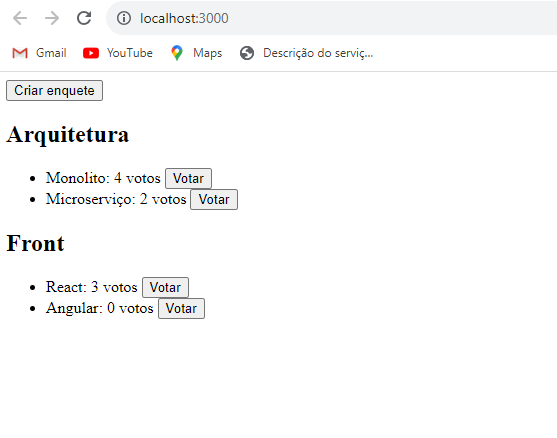

# Título do projeto

Esse projeto é uma api Graphql responsável por criar enquetes e computar votos em tempo real. As informações são armazenadas no Realtime database do firebase. Para publicar ele foi integrado ao framework serverless para ser publicado na AWS Lambda

### 🔧 Instalação

No terminal, clone o projeto:

```
git clone https://github.com/diego-silva1016/serverless_graphql.git
```

Entre na pasta do projeto e rode:

```
yarn install
```

Crie um arquivo .env e adicione a chave do banco firebase.

Para iniciar o servidor, rode o comando:

```
node src/index.js
```

Para iniciar o front end da aplicação, entre na pasta voting-front e rode o comando:

```
yarn install
```

Para iniciar o front, rode o comando:

```
yarn start
```



## 🛠️ Construído com

* [Apollo Graphql](https://www.apollographql.com/docs/apollo-server/)
* [Serverless](https://www.serverless.com/)
* [Firebase](https://firebase.google.com/?hl=pt)
* [React](https://react.dev/)